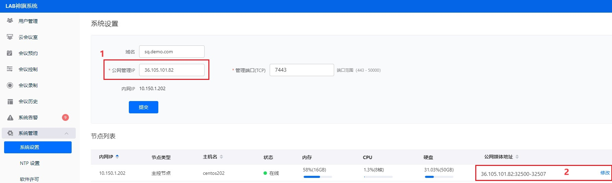
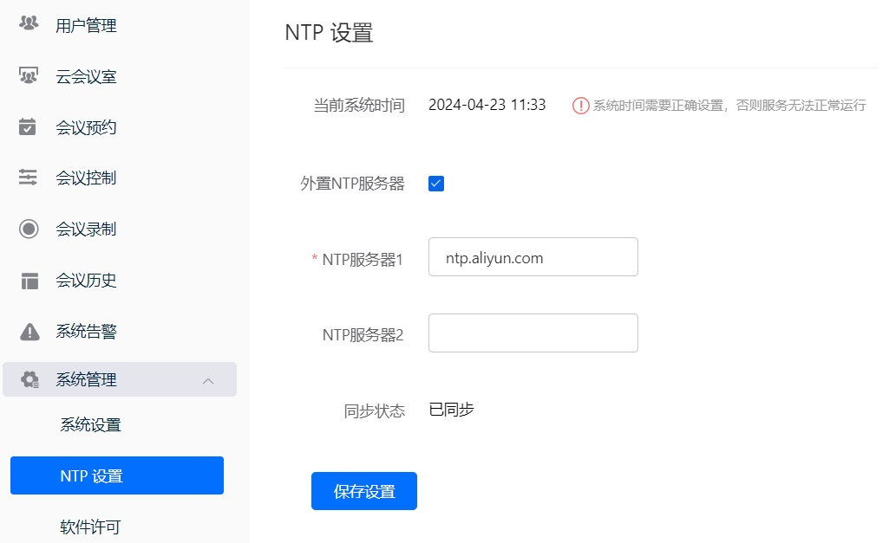
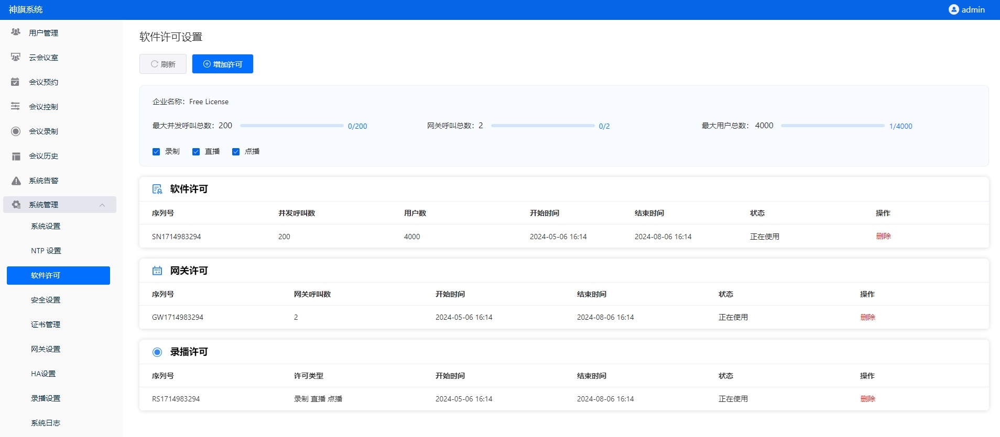

# 神旗服务平台基础配置

本页主要说明服务平台安装完成后，如何配置服务平台以提供基本的会议服务。

配置下述功能均需登录神旗服务平台web管理页面:

登录地址: https://server IP:7443，例: https://10.150.1.202:7443

默认管理用户: admin    密码: Admin123!@#  (登录后请修改密码)

## 一. 系统设置

登录web管理页面后，导航到系统管理 -> 系统设置，配置系统所需的网络和端口。

- 若您的系统仅工作在内网，可以保持默认设置。也可以根据需要配置内网域名、管理端口（默认为：7443）；在系统设置→节点列表→修改 页面，配置媒体端口（默认为：32500-32507）。

- 若您将神旗服务平台部署在企业DMZ或云平台，需要从公网访问神旗服务平台提供的登录、约会、参会等服务，需按照以下步骤配置：

- ✅准备：公网ip，域名（可选）。

- ✅配置防火墙：在DMZ或云平台的防火墙上将公网ip（例：36.105.101.82）映射到神旗服务平台的内网ip（例：10.150.1.202），并在防火墙上打开您系统配置的管理端口和媒体端口组（例：打开tcp：7443，udp: 32500 - 32507）。

- ✅配置公网：导航到神旗服务平台管理页面→系统管理→系统设置，配置公网管理ip（图标1），管理端口，公网媒体ip（图标2）及媒体端口，提交修改，服务自动重启后，修改生效。

配置完成后，即可通过域名或公网ip访问神旗的相关服务。

## 二. NTP设置

系统管理 -> NTP设置，配置NTP服务器，确保系统时间与标准时间同步，否则服务无法正常运行。

## 三. 软件许可

查看软件许可，确保许可尚在有效期。

服务器安装和基本配置已经完成

## 四. 测试基本功能

查看软件许可，确保许可尚在有效期。

1. 在web管理页面预约一个会议，查看会议详情，获取会议URL或二维码。
2. 安装两个神旗客户端，通过点击URL 或 扫描二维码加入会议，测试音视频是否正常。
3. 基本测试通过后，您可以开始使用神旗进行会议等音视频协作。

如需更多功能，请参考神旗服务平台高级配置，配置和使用更多功能。