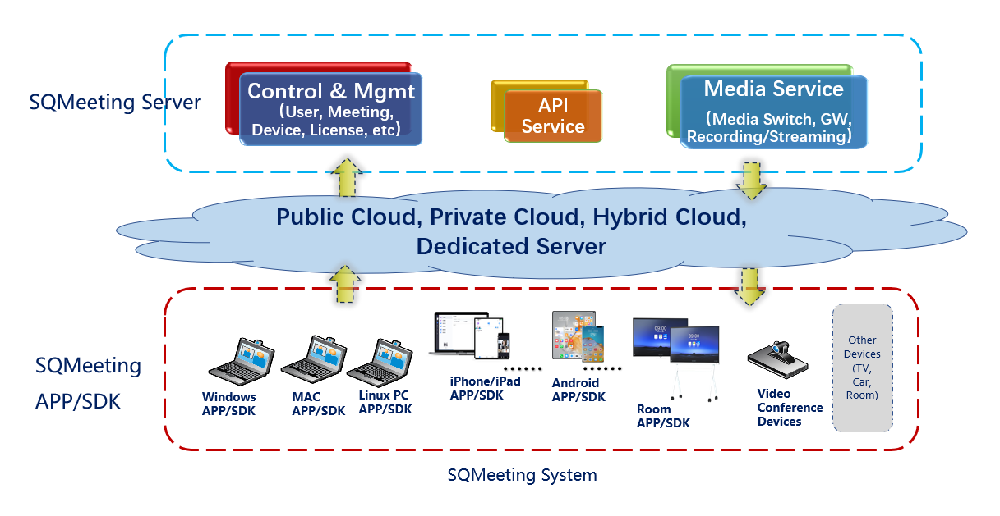

# 神旗视讯&nbsp;&nbsp;&nbsp;&nbsp;&nbsp;&nbsp;高性能，私有化的音视频解决方案!

[English](./index) | [简体中文](./index_cn)

## 系统介绍


ℹ️ 神旗视讯是全球领先的开源音视频协作系统，包含真正企业级质量的，开箱即用的客户端、SDK和服务平台。

ℹ️ 任何政府组织、企业、团体或个人都可以快速部署和使用神旗视讯进行实时的音视频协作和定制化开发。

ℹ️ 3分钟私有化部署，企业数据完全自己掌控，没有会议时长等各种限制，随心随意开会！

## 系统架构



## 核心优势
 
###  高性能：
✅ 单机容量最高，8核/16G硬件配置可支持800方1080p30全高清视频会议，比同类产品高50%~100%

### 高质量：
✅ 全新的SVC编码及媒体交换技术，低时延，抗丢包，弱网自适应

### 可定制：
✅ 开放的源码和先进的架构，开发者可自由定制所需功能和自己的音视频系统

### 内置录制和直播服务：
✅ 用户可以一键启动录制和直播服务，使用浏览器就可以观看直播

### 内置H323 Gateway服务：
✅ 用户可以使用传统会议室终端拨入会议

### 高安全：
✅ 全程加密，保护数据安全，保护隐私


# 神旗服务平台快速安装

## 神旗服务平台安装须知


✅ 神旗服务平台部署简单，3分钟即可快速搭建私有化高清音视频系统。

ℹ️ 神旗视讯服务平台可以安装在任何公有云VM、私有云VM、独立服务器、NUC小主机，或者个人PC和笔记本电脑。

## 快速安装

1. ***根据支持的Linux系统，准备Linux server VM. (至少4cpu, 8GB memory, 40GB disk)***
2. ***下载神旗视讯server安装包，上传到Linux server VM，解压缩***
```bash
tar -zxvf FrtcServer-x86_64-x.x.x-*****.tgz
```

3. ***检查系统是否满足安装要求***
```bash
./frtc-setup check
```

4. ***运行安装命令***
```bash
./frtc-setup install
```

5. ***使用浏览器访问 https://your-linux-server-IP:7443 进行配置.***

config 说明:


## x86 Server (Ubuntu| CentOS | Rocky Linux| AlmaLinux|RHEL)

| 下载连接 | SHA1 |
|-----------|-----------|
| [下载](https://shenqi-dl.internetware.cn/server/FrtcServer-x86_64-3.4.2-3804.tgz)| 41e568580faf6169414d538b5d866d99601233db |


## arm64 Server(Ubuntu| CentOS | Rocky Linux| AlmaLinux|RHEL)


| 下载连接 |  SHA1 |
|-----------|-----------|
| [下载](https://shenqi-dl.internetware.cn/server/FrtcServer-arm64-3.4.2-3802.tgz)     | 2019abfbe5ccfe83330e521086d538da3d70c1ec |


# 神旗视讯客户端

ℹ️ 神旗视讯客户端支持全平台安装，功能丰富，具备真正企业级质量。

ℹ️ 请根据您电脑或移动设备的操作系统和CPU型号，下载相应客户端版本。

## 神旗视讯客户端下载

| 客户端系统 | 下载 | SHA1 |
|---------|---------|---------|
| Windows|[下载](https://shenqi-dl.internetware.cn/client/SQMeeting-win-release-3.4.2-610.msi) | e7ab76e9bad170d44c8e7fcc5b84133cf3fae26d |
| MacOS|[下载](https://shenqi-dl.internetware.cn/client/SQMeeting-Mac-3.4.2.403.dmg)| f6cbbafdd0d0030fc976c22873081716b1c3e5d2 |
| MacOS arm64|[下载](https://shenqi-dl.internetware.cn/client/SQMeeting-Mac-arm64-3.4.2.403.dmg)| c025e560fd4bc7042ea7c8f69473f90e1e329819 |
| Linux x86| [下载](https://shenqi-dl.internetware.cn/client/SQMeeting-linux-x86_64-3.4.1.20250307.tar.gz) | 1867c6c1435b199cd6694e0596e1e41cdd6899b6 |
| Linux arm64| [下载](https://shenqi-dl.internetware.cn/client/SQMeeting-linux-arm64-3.4.1.20250307.tar.gz) | 98b69d2f56aaacbf6851f364f64836b7dc41a6b2 |
| Android|| ac7a25d43efb90334b1035c6ffecf33fc1972b64 |
| iPhone|| |
| iPad|| |


## 神旗视讯Rooms下载
神旗视讯Rooms用于MAXHUB, Newline等会议室设备

| 会议室系统 | 下载 | SHA1 |
|---------|---------|---------|
| Android Room |[下载](https://shenqi-dl.internetware.cn/client/SQMeetingRooms-android-1.2.0.517.apk) | 131f4f2c911c5e90f6422bebfc83fde48b1d5e5b |
| Windows Room |[下载](https://shenqi-dl.internetware.cn/client/SQMeeting-win-release-3.4.2-610.msi) | e7ab76e9bad170d44c8e7fcc5b84133cf3fae26d |


## 联系我们获取商业支持

📝[yunling@dcholdings.com](mailto:yunling@dcholdings.com)

💡 [讨论](https://github.com/orgs/sqmeeting/discussions)

🌐 [开源地址: https://github.com/sqmeeting](https://github.com/sqmeeting)