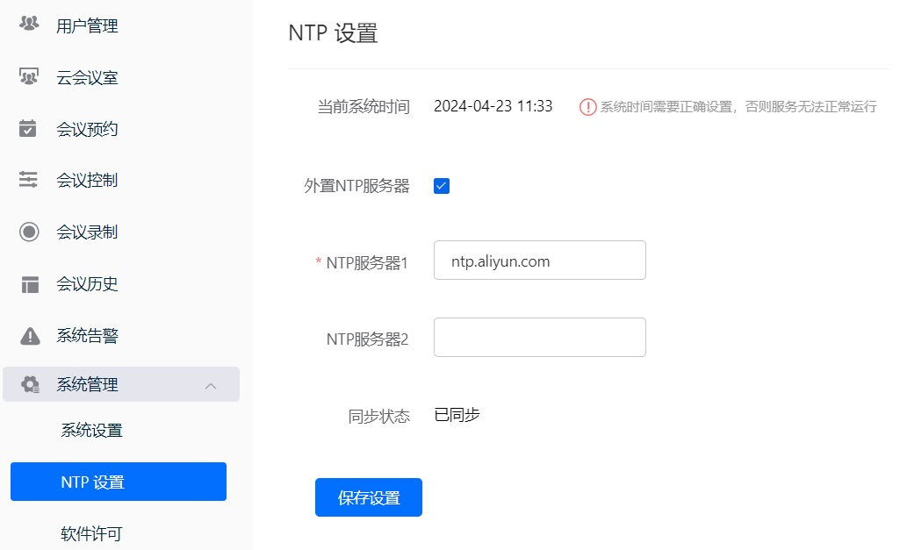
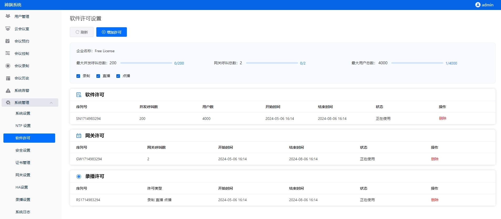

# Configuration

This page explains how to configure SQMeeting Server after installation to provide basic meeting services.

To configure the following functions, you need to log in to the SQMeeting Server web management page:

Login address: https://server-IP:7443, e.g.: https://10.150.1.202:7443

Default admin user: admin    
Password: Admin123!@#  (Please change the password after login)

## I. System Settings

After logging into the web management page, navigate to System Management -> System Settings to configure the network and ports required by the system.

- If your system only works on the intranet, you can keep the default settings. You can also configure the intranet domain name and management port (default: 7443) as needed; in the System Settings → Node List → Modify page, configure the media ports (default: 32500-32507).

- If you deploy the SQMeeting Server in an enterprise DMZ or cloud platform and need to access SQMeeting Server's login, scheduling, and meeting services from the public network, you need to configure the following:

- ✅Preparation: Public IP, domain name (optional).

- ✅Configure firewall: Map the public IP (e.g., 36.105.101.82) to the internal IP of SQMeeting Server (e.g., 10.150.1.202) on the DMZ or cloud platform firewall, and open the management port and media port group configured in your system (e.g., open tcp: 7443, udp: 32500 - 32507).

- ✅Configure public network: Navigate to SQMeeting Server management page → System Management → System Settings, configure the public management IP (icon 1), management port, public media IP (icon 2) and media ports, submit the changes, and the service will automatically restart for the changes to take effect.

After configuration is complete, you can access SQMeeting services through the domain name or public IP address.

## II. NTP Settings

System Management -> NTP Settings, configure NTP server to ensure system time synchronizes with standard time, otherwise the service cannot operate normally.

## III. Software License

Check the software license to ensure it is still valid.

Server installation and basic configuration is now complete

## IV. Test Basic Functions

Check the software license to ensure it is still valid.

1. Schedule a meeting on the web management page, check the meeting details, and get the meeting URL or QR code.
2. Install two SQMeeting clients, join the meeting by clicking the URL or scanning the QR code, and test if audio and video are working normally.
3. After the basic test is passed, you can start using SQMeeting for meetings and other audio-video collaboration.

For more features, please refer to SQMeeting Server Advanced Configuration to configure and use additional functionality.
