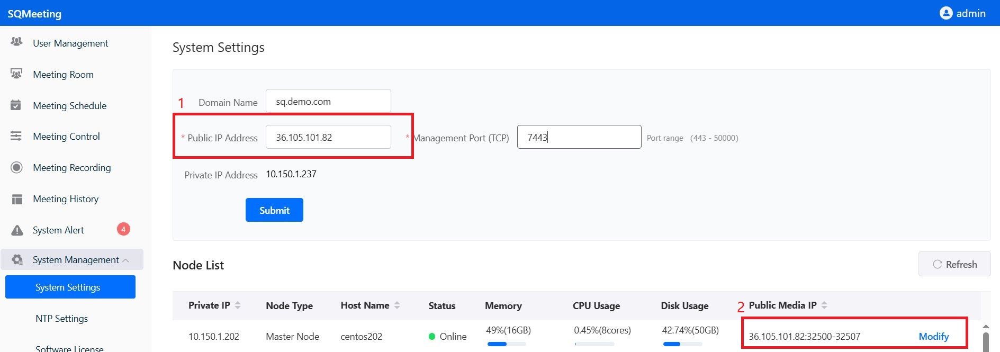
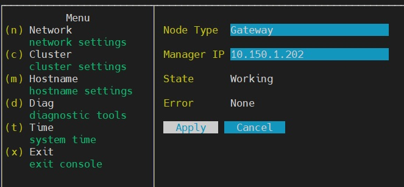
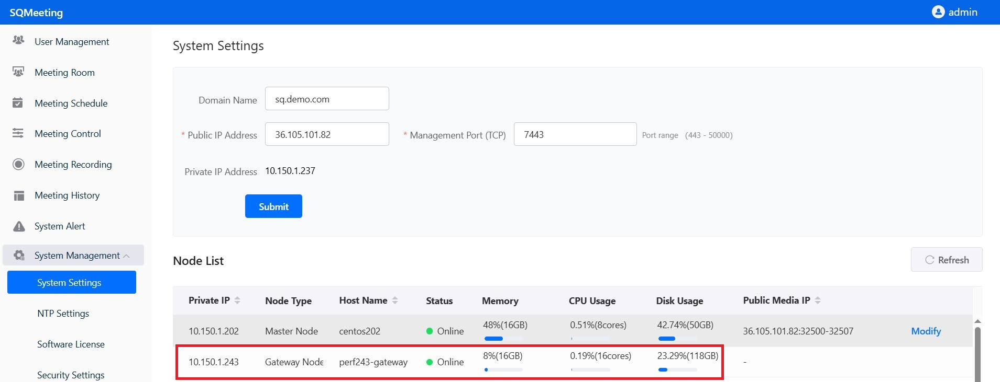
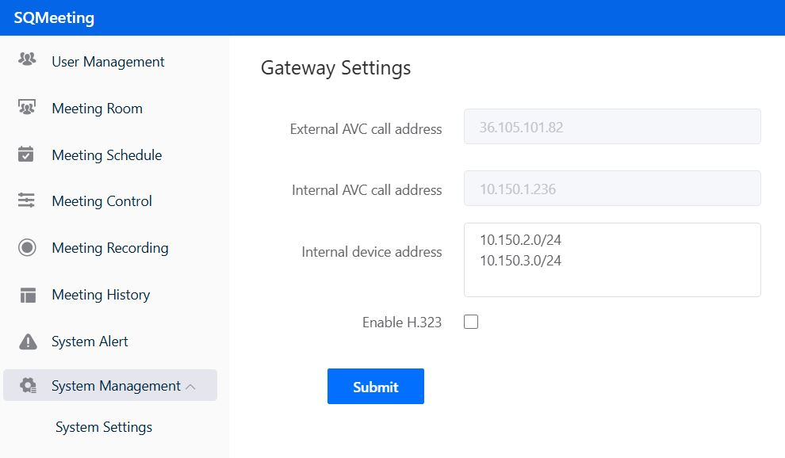
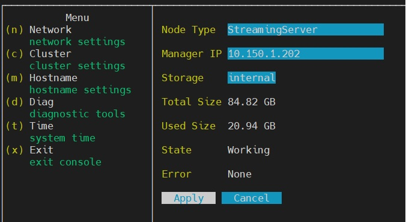
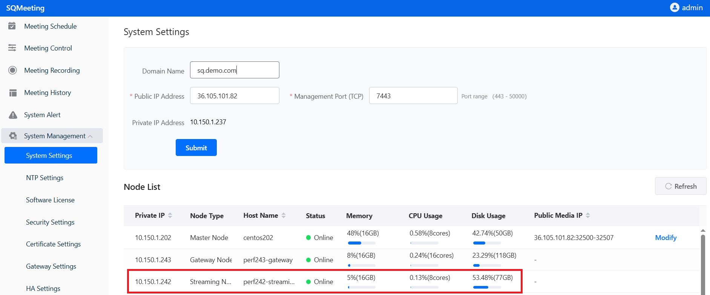
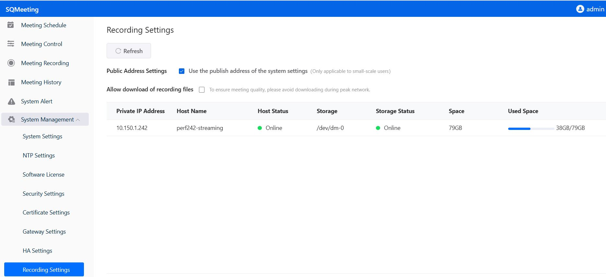

# Install

## Basic install (single node)

1. ***Prepare a Linux server VM according to supported Linux systems. (Minimum: 4 CPUs, 8GB memory, 40GB disk)***
2. ***Download the SQMeeting server installation package, upload it to the Linux server VM, and extract it***
```bash
tar -zxvf FrtcServer-x86_64-x.x.x-*****.tgz
```

3. ***Verify if the system meets the installation requirements***
```bash
./frtc-setup check
```

4. ***Run the installation command***
```bash
./frtc-setup install
```

5. ***Access https://your-linux-server-IP:7443 via browser to configure.***


## System Settings

You need to log in to the SQMeeting Server web management page to finish the basic settings. 

Login address: https://server-IP:7443, e.g.: https://10.150.1.202:7443

Default admin user: admin    
Password: Admin123!@#  (Please change the password after login)

After logging into the web management page, navigate to System Management -> System Settings to configure the network and ports required by the system.

- If your system only works on the intranet, you can keep the default settings. You can also configure the intranet domain name and management port (default: 7443) as needed; in the System Settings → Node List → Modify page, configure the media ports (default: 32500-32507).

- If you deploy the SQMeeting Server in an enterprise DMZ or cloud platform and need to access SQMeeting Server's login, scheduling, and meeting services from the public network, you need to configure the following:

- ✅Preparation: Public IP, domain name (optional).

- ✅Configure firewall: Map the public IP (e.g., 36.105.101.82) to the internal IP of SQMeeting Server (e.g., 10.150.1.202) on the DMZ or cloud platform firewall, and open the management port and media port group configured in your system (e.g., open tcp: 7443, udp: 32500 - 32507).

- ✅Configure public network: Navigate to SQMeeting Server management page → System Management → System Settings, configure the Public IP Address (label 1), Management Port, Public Media IP (label 2) and Media Ports, submit the changes, and the service will automatically restart for the changes to take effect.



After configuration is complete, you can access SQMeeting server through the domain name or public IP address.

## NTP Settings

System Management -> NTP Settings, configure NTP server to ensure system time synchronizes with standard time, otherwise the SQMeeting server is not running properly.

***Server installation and basic configuration is now complete! You can start a meeting now!***


## Add Gateway Node 

Gateway node is used for h323 device dialing in SQMeeting. 
Gateway node is also used for recording and live streaming.  

This section explains how to configure gateway services on the SQMeeting server. The gateway service is mainly used for interconnection between the SQMeeting system and H.323 conference room equipment.

To obtain gateway services, you need to:

1. ✅Install and configure the gateway node
2. ✅Configure the H.323 service

#### 1 Installation Preparation
Resources needed for installation:

Please prepare a dedicated VM to install the SQMeeting gateway node, do not share the VM with other services!

- ✅Minimum configuration: 4 logical CPU cores, 4GB Memory, 100GB or more system disk (Note: Supports 1 interconnection)
- ✅Recommended configuration: 16 logical CPU cores, 16GB Memory, 120GB or more system disk (Note: Supports 4 interconnections)
- ✅CPU requirements: 2.3GHz or higher frequency; x86 needs to support avx2

#### 2 Installing the Gateway Node
The installation package used for the gateway node is the same as the main service platform, but with different configuration. Based on different CPU architectures and operating system versions, refer to the service platform download and installation guide. For example, on Ubuntu systems, find the corresponding "SQMeeting Service Platform Installation Package Download" for Ubuntu, download the installation package, and then follow "II. Installation" in the "SQMeeting Service Platform Ubuntu Installation Guide" to install the gateway node.

Important!!!
When running the installation command, choose "no" for free license
After the node installation is complete, there is no need to perform web configuration, return to this page for adding the gateway node and configuring the service

#### 3 Adding the Gateway Node
After the gateway node is successfully installed, SSH login to the VM where the gateway node is located.
Run the command `su - frtc_console` to enter the console.
Navigate to Cluster, add the gateway node to the SQMeeting server


Specific operation: Select "Gateway" for Node Type, fill in the service platform's intranet address for Manager IP, click Apply to join the cluster, wait for the system to restart.

Confirm that the gateway node has successfully joined the service platform
Log in to the service platform web management page (e.g., https://10.150.1.202:7443).
Navigate to System Management -> System Settings, confirm that the gateway node has successfully joined the SQMeeting server, and that the node status is normal.


#### 4 Interconnection with H.323 Equipment
If H.323 equipment is on the intranet where the service platform is located, you need to first add the intranet device IP range to the service platform.
Log in to the service platform web management page (e.g., https://10.150.1.202:7443), navigate to System Management -> Gateway Settings, add the intranet device address range, as shown in the format below:


Methods for interconnecting with H.323 equipment:
- ✅If the H.323 device is on the service platform's intranet, call: Service platform intranet address##SQMeeting meeting number (e.g., 10.150.1.202##666888), check if audio, video, and dual stream can be interconnected
- ✅If the H.323 device is on the service platform's external network, call: Service platform external network address##SQMeeting meeting number (e.g., 36.105.101.82##666888), check if audio, video, and dual stream can be interconnected

## Add Streaming node for recording and live streaming
   
   please install gateway node first. 

### 1. Recording and Streaming Service Configuration

This page explains how to configure recording and streaming services on the SQMeeting server.

To get recording and streaming services, you need to:

1. ✅Install the gateway node
2. ✅Install and configure the recording node

#### 2. Installation Preparation
Resources needed for installation:

Please prepare a dedicated VM to install the SQMeeting recording and streaming node, do not share the VM with other services!

- ✅Minimum configuration: 4 logical CPU cores, 8GB Memory, 100GB or more system disk (Note: Minimum configuration is for testing only)
- ✅Recommended configuration: 8 logical CPU cores, 16GB Memory, 120GB or more system disk, 500GB or more data disk
- ✅CPU requirements: 2.3GHz or higher frequency; x86 needs to support avx2

#### 3. Installation Steps
Based on different CPU architectures and operating system versions, refer to step two of the service platform download and installation guide to install the recording node

Important!!!
When running the installation command, choose "no" for free license
After the node installation is complete, there is no need to perform web configuration, return to this page for adding the recording node and configuring the service

#### 4. Adding the Recording Node
After the recording node is successfully installed, SSH login to the VM where the gateway node is located.
Run the command `su - frtc_console` to enter the console.
Navigate to Cluster, add the recording node to the SQMeeting server


Specific operation: Select "StreamingServer" for Node Type, fill in the service platform's intranet address for Manager IP, click Apply to join the cluster, wait for the system to restart.

#### 5. Configuring Recording Service
After the recording node joins the cluster, log in to the service platform web management page (e.g., https://10.150.1.202:7443).
Navigate to System Management -> System Settings, confirm that the recording node has successfully joined the SQMeeting server, and that the node status is normal.



Navigate to System Management -> Recording Settings.

If the number of concurrent streaming viewers is small, you can select "Use the public network address set by the system".


If you are providing official recording services, you need to configure dedicated public network address, domain name, bandwidth for streaming, and install certificates.

#### 6. Recording and Streaming Test
Users with meeting administrator or system administrator privileges log in to the SQMeeting client, start an instant meeting, and click "Start Recording" and "Start Streaming" on the toolbar at the bottom of the meeting interface.


## How to Remove the Existing System

Use the frtc-setup remove tool in the installation directory to uninstall the server platform software system, and restart the server after completion.

```bash
./frtc-setup remove
```

In the interactive environment, enter "yes" to keep backup data; enter "no" to not keep backup data.

After execution is complete, the system will automatically restart.


## HA deployment

  SQMeeting server support HA deployment. 
  please contact us for support. 


## Test Basic Functions

Check the software license to ensure it is still valid.

1. ✅Schedule a meeting on the web management page, check the meeting details, and get the meeting URL or QR code.
2. ✅Install two SQMeeting clients, join the meeting by clicking the URL or scanning the QR code, and test if audio and video are working normally.
3. ✅After the basic test is passed, you can start using SQMeeting for meetings and other audio-video collaboration.

