# Configuration

This page explains how to configure SQMeeting Server after installation to provide basic meeting services.

To configure the following functions, you need to log in to the SQMeeting Server web management page:

Login address: https://server-IP:7443, e.g.: https://10.150.1.202:7443

Default admin user: admin    
Password: Admin123!@#  (Please change the password after login)

## 1. System Settings

After logging into the web management page, navigate to System Management -> System Settings to configure the network and ports required by the system.

- If your system only works on the intranet, you can keep the default settings. You can also configure the intranet domain name and management port (default: 7443) as needed; in the System Settings → Node List → Modify page, configure the media ports (default: 32500-32507).

- If you deploy the SQMeeting Server in an enterprise DMZ or cloud platform and need to access SQMeeting Server's login, scheduling, and meeting services from the public network, you need to configure the following:

- ✅Preparation: Public IP, domain name (optional).

- ✅Configure firewall: Map the public IP (e.g., 36.105.101.82) to the internal IP of SQMeeting Server (e.g., 10.150.1.202) on the DMZ or cloud platform firewall, and open the management port and media port group configured in your system (e.g., open tcp: 7443, udp: 32500 - 32507).

- ✅Configure public network: Navigate to SQMeeting Server management page → System Management → System Settings, configure the public management IP (icon 1), management port, public media IP (icon 2) and media ports, submit the changes, and the service will automatically restart for the changes to take effect.


After configuration is complete, you can access SQMeeting services through the domain name or public IP address.

## 2. NTP Settings

System Management -> NTP Settings, configure NTP server to ensure system time synchronizes with standard time, otherwise the service cannot operate normally.


## 3. Software License

Check the software license to ensure it is still valid.


Server installation and basic configuration is now complete


## 4. Certificate

The system comes with a default self-signed certificate. When accessing the server website through a browser, you may receive security warning prompts.

It is recommended that users install a certificate authenticated by a CA authority. You can upload your own certificate through the certificate management interface on the server website. Please refer to the image below for certificate format requirements:

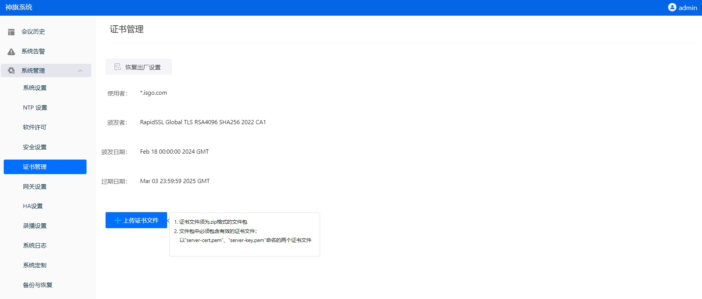


## 5. License

How to install a license:

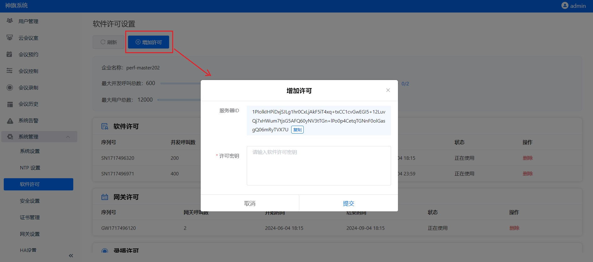

1. Get the Server ID: Navigate to System Management -> Software License, click Add License, then click Copy to get the Server ID.
   Note: For HA license applications, you need to obtain Server IDs from both the HA primary server and HA secondary server.

2. Apply for a license: Send the Server ID to the community administrator, specify the license type, purpose, and quantity, then wait for the community administrator's approval.

3. Install the license: Navigate to System Management -> Software License, click Add License, paste the approved license into the License Key field, and click Submit.
   Note: To install an HA license, you need to log in to the web management page of the HA primary server.

4. Confirm the license: Check the installed license on the license page to ensure the license type, quantity, validity period, etc., meet your requirements.


## 6. System Upgrade

How to perform a system upgrade:

1. Download the SQMeeting system upgrade package:
   - For x86 platform: FrtcServer-x86_64-x.x.x-xxxxx.bin
   - For arm64 platform: FrtcServer-arm_64-x.x.x-xxxxx.bin

2. Navigate to SQMeeting Server management page → System Management → System Upgrade, upload the upgrade package to perform the upgrade. The upgrade process takes approximately 10 minutes.

### 7. System Rollback

The SQMeeting system does not support automatic rollback. If you have installed a higher version and want to roll back to a lower version, you need to first remove the existing system and then reinstall it.

### 8. How to Remove the Existing System

Use the frtc-setup remove tool in the installation directory to uninstall the server platform software system, and restart the server after completion.

```bash
./frtc-setup remove
```

In the interactive environment, enter "yes" to keep backup data; enter "no" to not keep backup data.

After execution is complete, the system will automatically restart.

### 9. How to Open the Service Platform Console

SSH login to the server, run the command `su - frtc_console` to open the console for configuration and diagnostics.

```bash
su - frtc_console
```

### 10. How to View or Modify the Service Platform's Network/DNS/Hostname

1. Launch the Service Platform Console

   After logging in with the system root account or other accounts, execute the command `su - frtc_console`

2. Network Settings

   After the service platform is installed, it uses DHCP by default. Please confirm that the address obtained by DHCP is consistent with the IP address configured in the operating system. Use this address to directly access the SQMeeting Server Web page for the next step of system configuration and management.

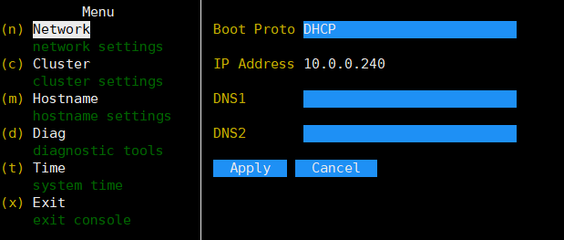

   You can also choose the Static mode to set up the system network. In the Boot Proto option, select Static, configure the static IP address (consistent with the operating system address), subnet mask, gateway, and DNS server. After setting, click Apply. After confirming the submission as prompted, the system will automatically restart. Once the restart is complete, the network settings will take effect.

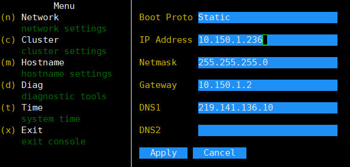

3. Setting Hostname and Domain

   Configure Hostname and Domain, click Apply to save and make the settings take effect.

### 11. How to Enhance System Security

You can enhance system security through the following methods:

1. Disable SSH Service
   
   After the service platform is installed and deployed, you can disable the SSH service to improve system security. If you perform a system security vulnerability scan, the SSH service must be turned off before scanning.
   
   To disable SSH, open the server console, navigate to the Diag page, select "Disable SSH", press Enter to confirm, and then click OK to confirm.

2. System Security Settings
   
   Access SQMeeting Server web page → System Management → Security Settings, set "Password Security Level" and "Password Validity Period", enable "Prohibit External Network Access to Management Page" to enhance system security.


### 12. Recording and Streaming Service Configuration

This page explains how to configure recording and streaming services on the SQMeeting server.

To get recording and streaming services, you need to:

1. Install the gateway node according to steps one to four of the meeting gateway guide
2. Install and configure the recording node according to the instructions on this page

#### 12.1 Installation Preparation
Resources needed for installation:

Please prepare a dedicated VM to install the SQMeeting recording and streaming node, do not share the VM with other services!

- Minimum configuration: 4 logical CPU cores, 8GB Memory, 100GB or more system disk (Note: Minimum configuration is for testing only)
- Recommended configuration: 8 logical CPU cores, 16GB Memory, 120GB or more system disk, 500GB or more data disk
- CPU requirements: 2.3GHz or higher frequency; x86 needs to support avx2

#### 12.2 Installation Steps
Based on different CPU architectures and operating system versions, refer to step two of the service platform download and installation guide to install the recording node

Important!!!
When running the installation command, choose "no" for free license
After the node installation is complete, there is no need to perform web configuration, return to this page for adding the recording node and configuring the service

#### 12.3 Adding the Recording Node
After the recording node is successfully installed, SSH login to the VM where the gateway node is located.
Run the command `su - frtc_console` to enter the console.
Navigate to Cluster, add the recording node to the SQMeeting server


Specific operation: Select "StreamingServer" for Node Type, fill in the service platform's intranet address for Manager IP, click Apply to join the cluster, wait for the system to restart.

#### 12.4 Recording License
Log in to the service platform web management page (e.g., https://10.150.1.202:7443).
Navigate to System Management -> Software License -> Recording License, confirm that the status and validity period of the recording license meets requirements.
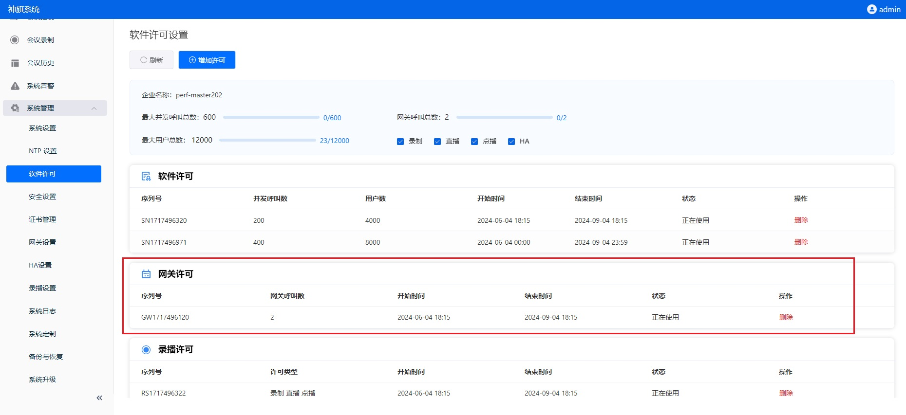

#### 12.5 Configuring Recording Service
After the recording node joins the cluster, log in to the service platform web management page (e.g., https://10.150.1.202:7443).
Navigate to System Management -> System Settings, confirm that the recording node has successfully joined the SQMeeting server, and that the node status is normal.

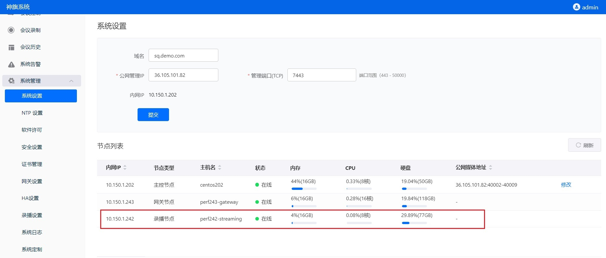

Navigate to System Management -> Recording Settings.

If the number of concurrent streaming viewers is small, you can select "Use the public network address set by the system".
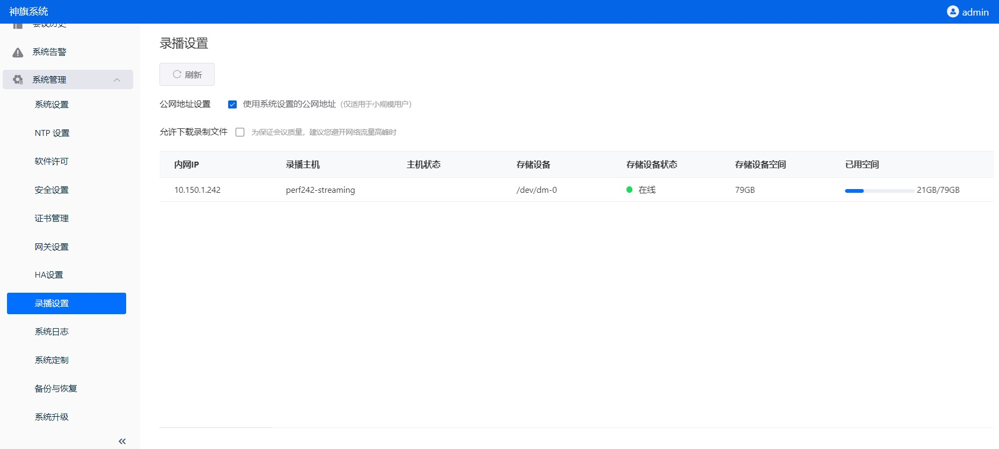

If you are providing official recording services, you need to configure dedicated public network address, domain name, bandwidth for streaming, and install certificates.

#### 12.6 Recording and Streaming Test
Users with meeting administrator or system administrator privileges log in to the SQMeeting client, start an instant meeting, and click "Start Recording" and "Start Streaming" on the toolbar at the bottom of the meeting interface.


### 13. Gateway

This section explains how to configure gateway services on the SQMeeting server. The gateway service is mainly used for interconnection between the SQMeeting system and H.323 conference room equipment.

To obtain gateway services, you need to:

1. Install and configure the gateway node
2. Configure the H.323 service

#### 13.1 Installation Preparation
Resources needed for installation:

Please prepare a dedicated VM to install the SQMeeting gateway node, do not share the VM with other services!

- Minimum configuration: 4 logical CPU cores, 4GB Memory, 100GB or more system disk (Note: Supports 1 interconnection)
- Recommended configuration: 16 logical CPU cores, 16GB Memory, 120GB or more system disk (Note: Supports 4 interconnections)
- CPU requirements: 2.3GHz or higher frequency; x86 needs to support avx2

#### 13.2 Installing the Gateway Node
The installation package used for the gateway node is the same as the main service platform, but with different configuration. Based on different CPU architectures and operating system versions, refer to the service platform download and installation guide. For example, on Ubuntu systems, find the corresponding "SQMeeting Service Platform Installation Package Download" for Ubuntu, download the installation package, and then follow "II. Installation" in the "SQMeeting Service Platform Ubuntu Installation Guide" to install the gateway node.

Important!!!
When running the installation command, choose "no" for free license
After the node installation is complete, there is no need to perform web configuration, return to this page for adding the gateway node and configuring the service

#### 13.3 Adding the Gateway Node
After the gateway node is successfully installed, SSH login to the VM where the gateway node is located.
Run the command `su - frtc_console` to enter the console.
Navigate to Cluster, add the gateway node to the SQMeeting server


Specific operation: Select "Gateway" for Node Type, fill in the service platform's intranet address for Manager IP, click Apply to join the cluster, wait for the system to restart.

Confirm that the gateway node has successfully joined the service platform
Log in to the service platform web management page (e.g., https://10.150.1.202:7443).
Navigate to System Management -> System Settings, confirm that the gateway node has successfully joined the SQMeeting server, and that the node status is normal.
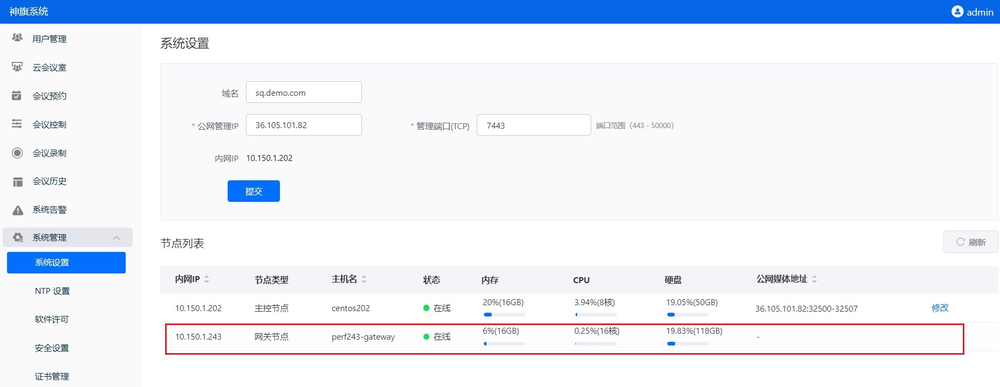

#### 13.4 Gateway License
Log in to the service platform web management page (e.g., https://10.150.1.202:7443).
Navigate to System Management -> Software License -> Gateway License, confirm that the status and validity period of the gateway license meets requirements.

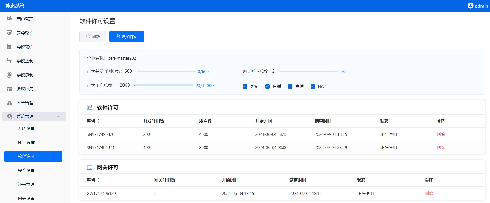

#### 13.5 Interconnection with H.323 Equipment
If H.323 equipment is on the intranet where the service platform is located, you need to first add the intranet device IP range to the service platform.
Log in to the service platform web management page (e.g., https://10.150.1.202:7443), navigate to System Management -> Gateway Settings, add the intranet device address range, as shown in the format below:
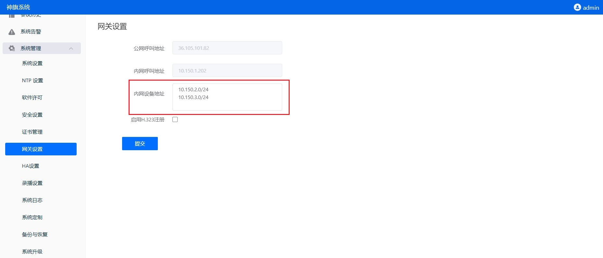

Methods for interconnecting with H.323 equipment:
- If the H.323 device is on the service platform's intranet, call: Service platform intranet address##SQMeeting meeting number (e.g., 10.150.1.202##666888), check if audio, video, and dual stream can be interconnected
- If the H.323 device is on the service platform's external network, call: Service platform external network address##SQMeeting meeting number (e.g., 36.105.101.82##666888), check if audio, video, and dual stream can be interconnected


### 14. HA deployment

This page explains how to configure HA (High Availability) services on the SQMeeting server.
The HA service is mainly used to ensure business continuity of the service platform, automatically switching to the backup server when the primary server fails.
To obtain HA services, you need to:

1. Install and configure the HA primary server, refer to the download and installation guide
2. Install and configure the HA backup server
3. Enable the HA service

#### 14.1 Installing the HA Backup Server
The VM resources required and installation steps for the HA backup server are the same as the primary server

Based on different CPU architectures and operating system versions, refer to the service platform download and installation guide to install the backup server

Important!!!
When running the installation command, choose "no" for free license
After the node installation is complete, there is no need to perform web configuration, return to this page for HA license activation and enabling the HA service

#### 14.2 Activating the HA License
Follow the steps shown in Advanced Configuration -> License Activation -> HA License Activation to submit the HA license application and activate the HA license on the HA primary server.
Log in to the service platform HA primary server web management page (e.g., https://10.150.1.202:7443).
Navigate to System Management -> Software License -> HA License, confirm that the status and validity period of the HA license meets requirements.

#### 14.3 Enabling the HA Service
Log in to the service platform HA primary server web management page (e.g., https://10.150.1.202:7443).
Navigate to System Management -> HA Settings, enable HA, fill in the HA backup server intranet address and HA virtual intranet IP.
Click Enable HA, wait for data synchronization to complete.
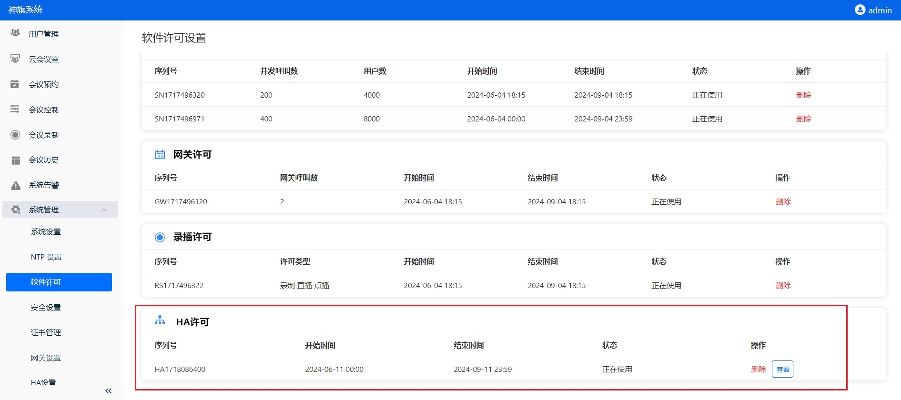

#### 14.4 HA System Settings

Confirm that the HA secondary server has successfully joined the service platform
Using the HA virtual IP, log in to the HA service platform web management page (e.g., https://10.150.1.236:7443).
Navigate to System Management -> System Settings, confirm that the HA secondary server has successfully joined the SQMeeting server, and that the node status is normal.


**Configure HA Domain Name, IP, and Media IP**

If the SQMeeting server only needs to be accessed from the intranet, configure the public management IP (as shown in box 1 above) as the HA intranet virtual IP (e.g., 10.150.1.236), domain name is optional.
If the SQMeeting server is deployed in an enterprise DMZ or public cloud and needs to be accessed from the external network, the following configuration is required:
1). Configure the HA public management IP (as shown in box 1 above) as the HA external network virtual IP, domain name is optional.
2). Configure the media address of the HA secondary server (as shown in box 2 above) as the corresponding external network address and port of the HA secondary server (default is UDP: 32500-32507)
3). You need to map the external network address of the HA secondary server to the intranet address on the firewall, and open the management port (default: TCP: 7443) and media ports (default: UDP: 32500-32507)

#### 14.5 HA Access
Intranet access:
Access the system through the HA domain name (e.g., https://sq-ha.demo.com:7443) or HA intranet virtual IP (e.g., https://10.150.1.236:7443), including login and calls.
External network access:
Access the system through the HA domain name (e.g., https://sq-ha.demo.com:7443) or HA external network virtual IP (e.g., https://36.105.101.81:7443), including login and calls.


###  Test Basic Functions

Check the software license to ensure it is still valid.

1. Schedule a meeting on the web management page, check the meeting details, and get the meeting URL or QR code.
2. Install two SQMeeting clients, join the meeting by clicking the URL or scanning the QR code, and test if audio and video are working normally.
3. After the basic test is passed, you can start using SQMeeting for meetings and other audio-video collaboration.

